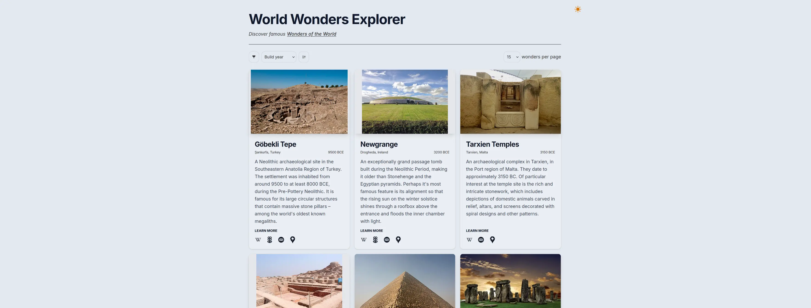

# World Wonders Explorer

## Description

A single page website intended as a demo of the [world-wonders-api](https://github.com/Rolv-Apneseth/world-wonders-api),
allowing users to explore and learn more about different [Wonders of the World](https://en.wikipedia.org/wiki/Wonders_of_the_World).

The site can be accessed at [explorer.world-wonders-api.org](https://explorer.world-wonders-api.org).

## Tools/Technologies

- [Leptos](https://leptos.dev/)
- [Tailwind CSS](https://tailwindcss.com/)
- [Cloudflare Pages](https://pages.cloudflare.com/) for hosting and continuous deployment
